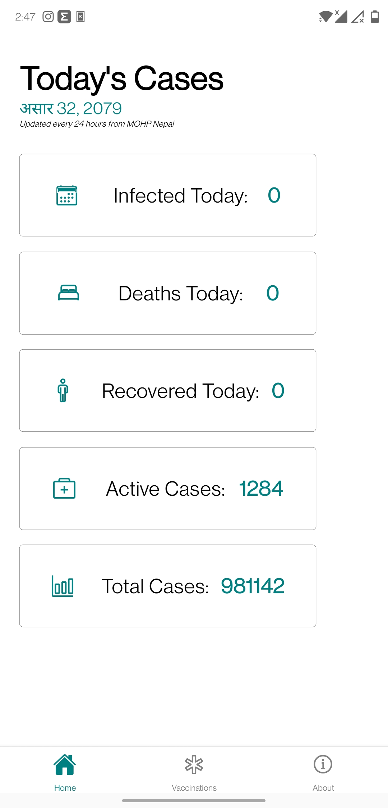
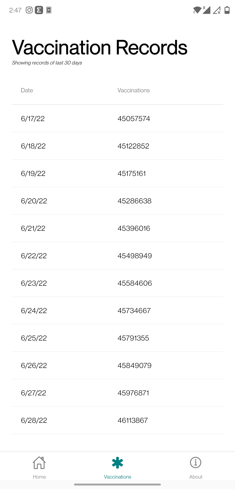
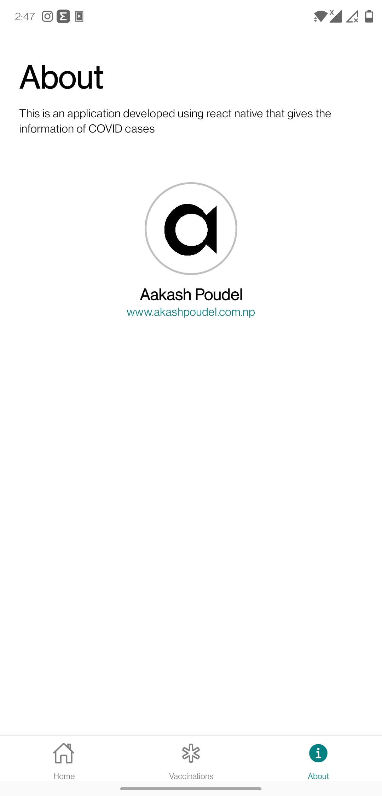

#  COVID Tracker 
This is an application developed using `react native` that gives the information of COVID cases
# Special Thanks 
- Open Disease Data API [disease.sh](https://disease.sh)
## Supported Platforms
- IOS
- Android
- Web
## Screenshots
 ### Home Screen
   

### Vaccinations Screen
  

### About Screen
  
 
 ## Demo
 You can find the prebuilt `apk` file in the `releases` section.
 
 # API Used
- Open Disease Data API [disease.sh](https://disease.sh)
- Today's Nepali Date API [akashpoudel.com.np](https://akashpoudel.com.np/nepalidate.php?api=true)
